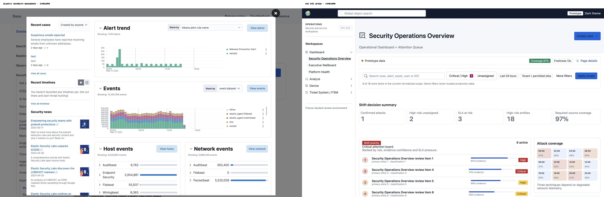
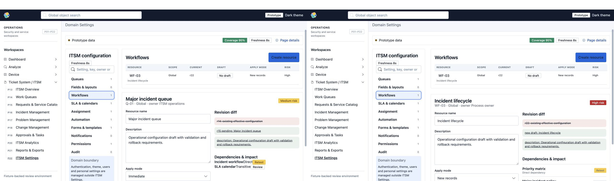
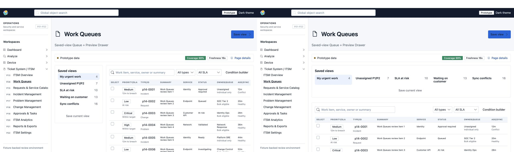

# P01–P22 Elastic/Kibana visual audit — after repair

Date: 2026-07-21

## Matched reference comparison

The repaired shell now follows the same broad visual grammar: restrained navigation, compact context controls, bounded white analysis panels, thin borders, low-radius corners, and clear vertical separation between independent modules.

## Before/after evidence

## Step health

1. **Elastic reference capture — healthy.** Official Elastic Security Overview was captured and inspected at 1440 × 900.
2. **P01–P22 default-state capture — healthy.** All 22 routes rendered without fatal state or document-level horizontal overflow.
3. **Navigation consistency — healthy.** Long page names render fully at the tested 1280px and 1440px widths after removing the redundant visible page IDs.
4. **Module spacing — healthy.** Measured top-level gaps changed from 16px to 24px across shared page compositions.
5. **P07 shared visual language — healthy.** It now uses the shared EUI header, context strip, bordered query panel, KPI panel and results panel.
6. **P14 queue density — healthy at 1280px.** Saved views reflow above the grid and the table no longer has panel or body overflow.
7. **P15 catalog interaction — healthy.** Catalog selection updates the detail surface and selected styling remains visible.
8. **P18 tab interaction — healthy.** Calendar, Queue and CAB remain interactive; the queue preserves a stable data-grid width.
9. **P22 settings interaction — healthy.** Section selection now synchronizes the table and editor; dependency rows no longer clip or overlap.

## Verification notes

- Visual screenshots: P01–P22 default states, plus representative interactions.
- Layout metrics: no document-level horizontal overflow; no meaningful clipped navigation/content labels detected.
- Accessibility scope: visible focus, semantic roles and accessible control names were observed for tested interactions. Full WCAG conformance was not claimed from screenshots alone.
