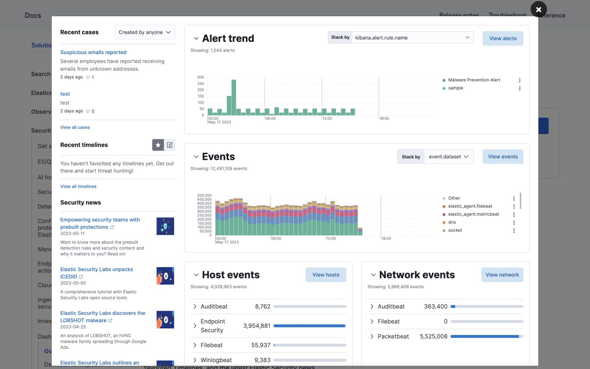

# P01–P22 Elastic/Kibana visual audit — before repair

Date: 2026-07-21
Product capture viewport: 1280 × 720
Elastic reference viewport: 1440 × 900; final comparison uses a matched 1440 × 900 capture.
Scope: P01–P22 default states plus representative queue, catalog, tab and settings interactions.

## Reference

The reference uses a restrained shell, compact controls, clear panel ownership, consistent borders, and generous separation between independent analysis modules. Dense data stays inside a clearly bounded panel instead of allowing adjacent content to visually merge.

## Current-state evidence

Representative screenshots:

- [P01 Security Operations Overview](before/p01.png)
- [P05 Alert Queue](before/p05.png)
- [P07 Event Search & Hunt](before/p07.png)
- [P08 Asset Inventory](before/p08.png)
- [P14 Work Queues](before/p14.png)
- [P15 Requests & Service Catalog](before/p15.png)
- [P18 Change Management](before/p18.png)
- [P22 ITSM Settings](before/p22.png)

Interaction evidence:

- [P14 queue selection](before/interaction-p14-selection.png)
- [P15 catalog selection](before/interaction-p15-catalog.png)
- [P18 queue tab](before/interaction-p18-queue.png)
- [P22 settings section](before/interaction-p22-workflows.png)

## Findings

1. **Navigation labels are clipped.** P01 and P15 titles exceed the available side-navigation label width because the visible page ID consumes part of the line.
2. **Independent modules are too close.** Most top-level page modules use 16px separation. At dashboard scale this makes filters, KPIs, tables and inspectors read as one dense block.
3. **P07 is a separate visual system.** Its header, prototype warning, KPI treatment and section padding differ from the shared P01–P22 frame.
4. **Dense tables collapse too aggressively.** P14 and the P18 queue view wrap several data columns into narrow cells instead of preserving a stable grid with horizontal overflow.
5. **P22 contains a confirmed overlap.** Dependency names, relationship labels and action badges share an unbounded row and visibly collide in the interaction screenshot.
6. **P22 section state is inconsistent.** Selecting `Workflows` updates the resource table while the editor can remain on the queue resource.
7. **Interaction feedback works but changes page density abruptly.** P14 selection inserts a full-width callout between controls and the grid, compressing the visible table area.

## Repair direction

- Preserve EUI defaults and use a 24px top-level module rhythm.
- Remove visible page IDs from side-navigation labels; retain route/page identity in code and page metadata.
- Bring P07 into the shared EUI page template and context-strip pattern.
- Give dense work queues stable minimum table widths with local horizontal scrolling.
- Rebuild P22 dependency rows as explicit two-column layout and synchronize editor selection with section changes.

## Evidence limits

Screenshots confirm visible hierarchy, clipping, overlap and response to representative interactions. They do not establish complete keyboard or screen-reader compliance; automated and keyboard checks remain separate verification work.
